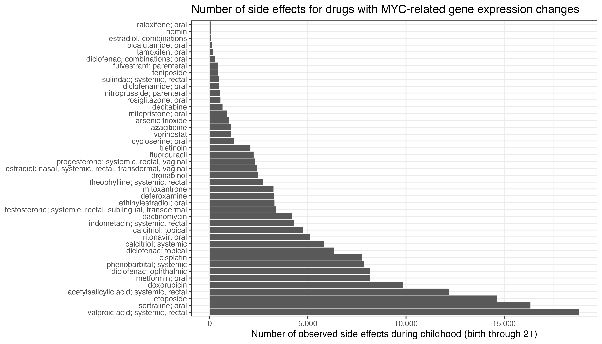
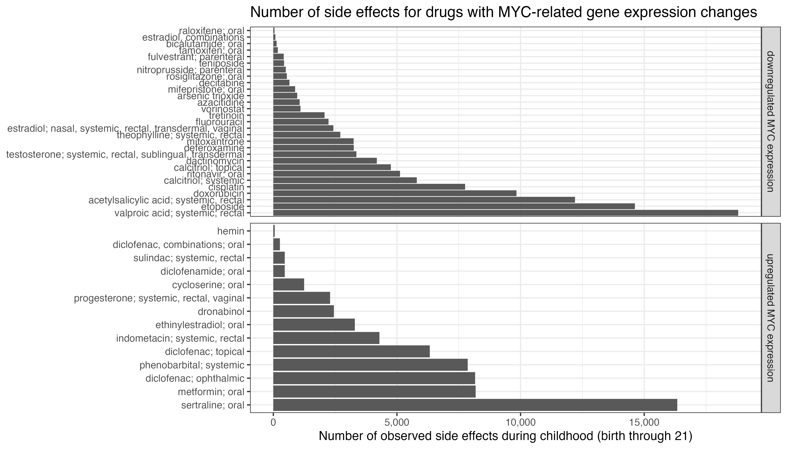
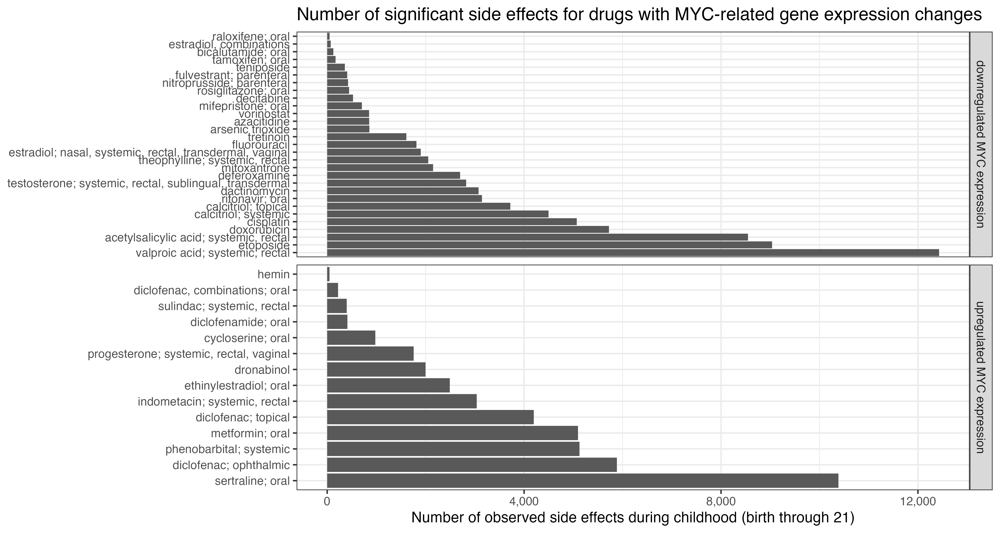
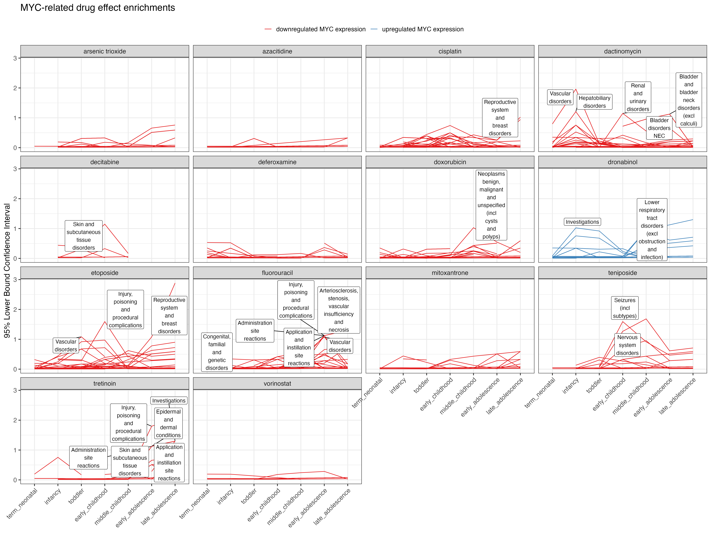

## Background

[MYC](https://en.wikipedia.org/wiki/Myc#:~:text=The%20Myc%20family%20consists%20of,the%20viral%20gene%20v%2Dmyc.&text=In%20cancer%2C%20c%2Dmyc%20is,often%20constitutively%20(persistently)%20expressed) is an oncoprotein and often implies worse outcomes, however it also seems to have a role in cardiovascular disease. [The Gabriella Miller Kids First Pediatric Research Program](https://kidsfirstdrc.org) has devoted significant resources to collect and standardize next generation sequencing data to investigate MYC in cardiovascular disease during childhood. 

[kidSIDES](https://github.com/ngiangre/kidsides) is an R data package that contains observation, summary, and model-level data from pediatric drug safety research. This resource can facilitate the investigation of drug safety related to MYC expression, specifically drugs that are substrates for MYC and proteins with its network. 

## Motivation

The kidSIDES resource has the unique opportunity to generate MYC-related pediatric drug safety profiles. Drugs can interact with proteins (e.g. inhibitors, agonists) as well as be substrates for different enzymes. The kidSIDES resource contains linkages between proteins (UniProt IDs) and drugs (ATC IDs). Gene expression results can be linked from genes (HUGO IDs) and proteins (Uniprot IDs). Through these linkages, we can integrate expression of genes with drug interactors/substrates. Then, the resource allows linking with potentially significant side effects across childhood for generating drug safety profiles. 

However, MYC is notorious for being "undruggable" [Ref](https://www.ncbi.nlm.nih.gov/pmc/articles/PMC6337544/). MYCc is actually a family of three homologs, where c-MYC (cellular MYC) is constituently expressed in cancers and is a known upregulator of gene expression. c-MYC binds to a non-specific DNA sequence to initiate transcription, and is known to influence mammalian [cell count](https://pubmed.ncbi.nlm.nih.gov/11742404/). Mitigating overexpression of MYC is a hypothesized mechanism for treating tumorigenesis by bromodomain (BRD) inhibitors such as [JQ1](http://www.ncbi.nlm.nih.gov/pubmed/21889194). It was shown to be an antiproliferative agent in a mouse model of multiple myeloma. A well known side effect of BRD inhibitors is [thrombocytopenia](http://www.ncbi.nlm.nih.gov/pubmed/32989227) which is actually used as a pharmacodynamic biomarker. To date there are no FDA approved BRD inhibitors. 

So, ow can we investigate drug safety profiles related to MYC expression? We used the pharmaco-transcriptomics feature in [DrugBank](https://go.drugbank.com/pharmaco/transcriptomics) and filtered by MYC to extract the drugs with any known association to MYc expression alterations. In total, there are [43 drugs](Drug names taken from [pharmaco-transcriptomics table on Drugbank where Gene==MYC](https://go.drugbank.com/pharmaco/transcriptomics?q%5Bg%5B0%5D%5D%5Bm%5D=or&q%5Bg%5B0%5D%5D%5Bdrug_approved_true%5D=all&q%5Bg%5B0%5D%5D%5Bdrug_nutraceutical_true%5D=all&q%5Bg%5B0%5D%5D%5Bdrug_illicit_true%5D=all&q%5Bg%5B0%5D%5D%5Bdrug_investigational_true%5D=all&q%5Bg%5B0%5D%5D%5Bdrug_withdrawn_true%5D=all&q%5Bg%5B0%5D%5D%5Bdrug_experimental_true%5D=all&q%5Bg%5B1%5D%5D%5Bm%5D=or&q%5Bg%5B1%5D%5D%5Bdrug_available_in_us_true%5D=all&q%5Bg%5B1%5D%5D%5Bdrug_available_in_ca_true%5D=all&q%5Bg%5B1%5D%5D%5Bdrug_available_in_eu_true%5D=all&commit=Apply+Filter&q%5Bdrug_precise_names_name_cont%5D=&q%5Bgene_symbol_eq%5D=MYC&q%5Bgene_id_eq%5D=&q%5Bchange_eq%5D=&q%5Binteraction_cont%5D=&q%5Bchromosome_location_cont%5D=)
) associated with up or down regulated MYC gene expression. See the medication data [below](#meds). 

We found varying drug safety signals for the 43 drugs in the kidSIDES resource:

There were 29 and 14 drugs associated with MYC down and upregulated gene expression, respectively. These groups each observed different side effects in kidSIDES:

kidSIDES information includes the adverse drug effects that are significant in comparison to randomly reported drugs and side effects:

We observed similar drug safety signal trends across childhood between te MYC expression categories:

We hypothesize that for these 43 drugs, there are significant drug safety signals across childhood for groups or classes of the observed side effects. The evidence is the result of a 2x2 test for significant signals of the drug for the side effects in the class. We show the lower 95% confidence interval to indicate a lower limit for the evidence available:

## Medication Data

|OMOP CONCEPT   | NAME   | Mode | Regulation |
|:--------------|:----   | :--- |:---------- |
|21603802|arsenic trioxide| systemic|downregulated |
|21604305|acetylsalicylic acid| systemic, rectal|downregulated|
|21601441|azacitidine| systemic|downregulated|
|21602517|estradiol| nasal, systemic, rectal, transdermal, vaginal|downregulated|
|21602522|estradiol, combinations| systemic| downregulated|
|21603837|bicalutamide| oral|downregulated|
|21605260|deferoxamine| ophthalmic, parenteral|downregulated|
|21602625|raloxifene| oral|downregulated|
|21600781|rosiglitazone| oral|downregulated|
|21603748|cisplatin|inhalant, parenteral|downregulated|
|21603641|diclofenac|ophthalmic| upgregulated|
|21600819|calcitriol|systemic| downregulated|
|21602040|calcitriol|topical| downregulated|
|21603732|doxorubicin|parenteral, topical|downregulated|
|21602516|ethinylestradiol|oral (natural and semisynthetic estrogens, plain)| upregulated|
|21603718|etoposide|systemic|downregulated|
|21601436|fluorouracil|systemic|downregulated|
|21603833|fulvestrant|parenteral|downregulated|
|21601236|hemin|systemic, topical|upregulated|
|21603941|indometacin|systemic, rectal|upregulated|
|21600747|metformin|oral|upregulated|
|21602623|mifepristone|oral|downregulated|
|21603738|mitoxantrone|parenteral|downregulated|
|21600435|nitroprusside|parenteral|downregulated|
|21603151|ritonavir| oral|downregulated|
|21604714|sertraline| oral| upregulated|
|21603942|sulindac|systemic, rectal|upregulated|
|21603831|tamoxifen|oral|downregulated|
|21603719|teniposide|parenteral|downregulated|
|21602510|testosterone|systemic, rectal, sublingual, transdermal|downregulated|
|21603332|theophylline|systemic, rectal|downregulated|
|21603793|[U] tretinoin|systemic|downregulated|
|21604422|valproic acid|systemic, rectal|downregulated|
|21603809|[U] vorinostat| oral|downregulated|
|21601442|decitabine| systemic|downregulated|
|21603730|dactinomycin|parenteral|downregulated|
|21603096|cycloserine| oral|upregulated|
|21600503|dronabinol| inhalant, nasal, oral, topical|upregulated|
|21603694|diclofenamide| oral|upregulated|
|21603959|diclofenac, combinations| oral|upregulated|
|21604051|diclofenac| topical (antiinflammatory prep., non-steroids for topical use)|upregulated|
|21604393|phenobarbital| systemic|upregulated|
|21602542|progesterone| systemic, rectal, vaginal|upregulated|

